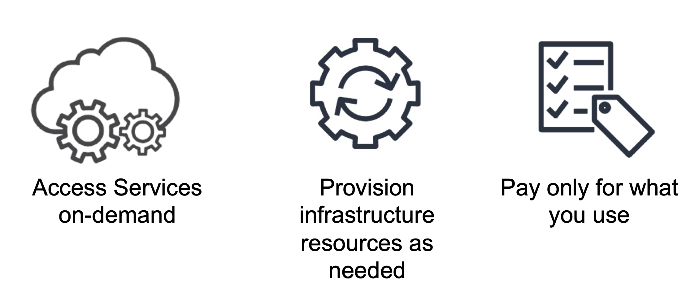
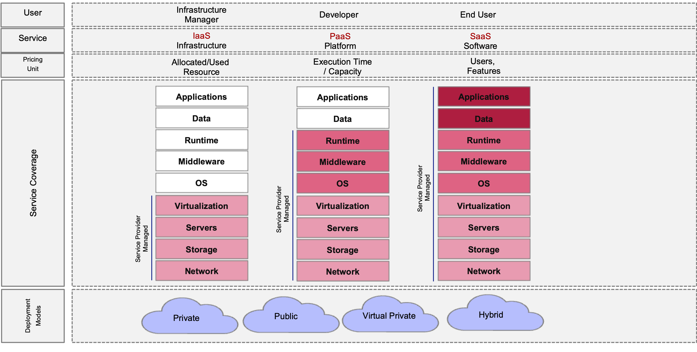
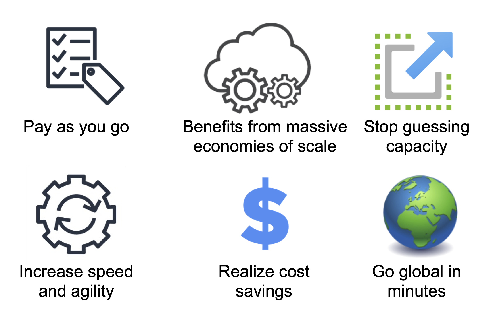

# Cloud Overview

## Insight 1. Cloud computing definition

Cloud computing is a technology that allows users to access and use computer resources (such as servers, storage, databases, networking, software, and more) over the internet, typically through a service provided by a third-party provider. Instead of owning and managing physical hardware and software, users can rent or subscribe to these resources on a pay-as-you-go basis, often referred to as a "pay-as-you-grow" model.

Here's a more detailed definition of cloud computing:

Cloud Computing: Cloud computing is a technology model that enables on-demand access to a shared pool of configurable computing resources (e.g., servers, storage, networks, applications, and services) over the internet. These resources can be rapidly provisioned and released with minimal management effort. Cloud computing providers deliver these services to businesses, organizations, and individuals, allowing them to scale their IT infrastructure and services easily without the need for substantial upfront investments in hardware and software.

Cloud computing is characterized by several key attributes, including scalability, flexibility, cost-effectiveness, and the ability to access resources remotely from anywhere with an internet connection. It has become a fundamental part of modern IT infrastructure and is used for various purposes, such as hosting websites and web applications, data storage and backup, running virtual machines, and supporting big data analytics, artificial intelligence, and machine learning workloads, among others. Popular cloud computing providers include Amazon Web Services (AWS), Microsoft Azure, Google Cloud Platform (GCP), and many others.

## Insight 2. Cloud computing services

SaaS, PaaS, and IaaS are three different categories of cloud computing services that provide varying levels of control and management over the underlying infrastructure and applications. 

Here's a breakdown of the key differences between SaaS, PaaS, and IaaS:

1. Software as a Service (SaaS):

Definition: SaaS is a cloud computing model in which software applications are hosted and provided as a service to users over the internet. Users access the software through a web browser, and the software is managed, maintained, and updated by the SaaS provider.
User Control: Users have the least control over the underlying infrastructure and application. They can customize settings and configurations within the application but cannot modify the underlying software or infrastructure.
Examples: Popular SaaS applications include Gmail, Microsoft 365 (formerly Office 365), Salesforce, and Dropbox.

2. Platform as a Service (PaaS):

Definition: PaaS is a cloud computing model that provides a platform or environment for developers to build, deploy, and manage applications. It includes tools, frameworks, and services for application development, such as databases, development frameworks, and application hosting.
User Control: Developers have control over the applications they build and deploy, including the code and application settings. However, they have limited control over the underlying infrastructure.
Examples: Microsoft Azure App Service, Google App Engine, and Heroku.

3. Infrastructure as a Service (IaaS):

Definition: IaaS is a cloud computing model that provides virtualized computing resources over the internet. Users can rent virtual machines, storage, and networking resources, giving them more control over the infrastructure compared to SaaS and PaaS.
User Control: Users have more control and responsibility for managing the virtual machines, operating systems, and software applications installed on them. They can configure and manage the infrastructure according to their needs.
Examples: Amazon Web Services (AWS) EC2, Microsoft Azure Virtual Machines, and Google Compute Engine.

In summary, the key difference between these cloud service models is the level of control and management they offer to users:

SaaS provides fully managed software applications, offering the least control over infrastructure.
PaaS offers a platform and development environment for building applications, with more control over applications and less over infrastructure.
IaaS provides virtualized infrastructure resources, giving users the most control and responsibility for managing infrastructure components.
The choice between these models depends on the specific needs of an organization or project, ranging from a focus on software usage (SaaS) to application development (PaaS) or infrastructure management (IaaS). Many organizations also use a combination of these models to meet different requirements within their IT ecosystems.

## Insight 3. Cloud computing benefits

Cloud computing offers a wide range of benefits for individuals, businesses, and organizations of all sizes. Here are some of the key advantages of using cloud services:

Scalability: Cloud services are highly scalable, allowing users to easily increase or decrease their computing resources as needed. This flexibility is particularly useful for businesses with fluctuating workloads, as they can avoid over-provisioning or under-provisioning resources.

Cost-Efficiency: Cloud computing follows a pay-as-you-go model, which means you only pay for the resources you actually use. This can result in cost savings compared to traditional on-premises infrastructure, as it eliminates the need for upfront capital expenditures on hardware and reduces ongoing maintenance costs.

Accessibility: Cloud services are accessible from anywhere with an internet connection, enabling remote access to applications and data. This accessibility is essential for remote work, collaboration, and business continuity, especially in times of crisis.

Reliability and Redundancy: Leading cloud providers offer high levels of reliability and redundancy. They have data centers in multiple geographic regions and employ advanced backup and failover mechanisms to ensure that services remain available even in the face of hardware failures or disasters.

Security: Cloud providers invest heavily in security measures and compliance certifications, making it easier for businesses to meet industry-specific and regulatory requirements. They often provide tools and services for identity management, encryption, and access control.

Automatic Updates and Patching: Cloud providers handle software updates, patching, and maintenance tasks, reducing the burden on IT staff. This ensures that applications and services are running the latest, most secure versions.

Backup and Disaster Recovery: Cloud services often include built-in backup and disaster recovery capabilities. Data can be automatically backed up and replicated to secure locations, helping organizations recover from data loss or disasters more effectively.

Collaboration and Productivity: Cloud-based collaboration tools and productivity suites enable seamless teamwork, document sharing, and real-time communication among employees, regardless of their physical location.

Innovation and Development: Cloud platforms provide a fertile ground for innovation, allowing developers to access a wide range of tools and services to build and deploy applications quickly. This accelerates the development cycle and fosters innovation.

Environmental Benefits: Cloud computing can be more environmentally friendly than traditional on-premises data centers because cloud providers can optimize resource utilization and energy efficiency on a large scale, reducing overall energy consumption and carbon emissions.

Global Reach: Cloud services are available globally, allowing businesses to expand their operations and reach customers in different regions without the need to set up and manage physical data centers in those locations.

Resource Utilization: Cloud providers often use virtualization and resource pooling techniques to maximize resource utilization, leading to more efficient use of computing resources.

Overall, cloud computing offers agility, cost savings, and access to a wide array of services that can transform the way businesses operate and innovate. However, it's important to choose the right cloud services and providers based on your specific needs and requirements to fully realize these benefits.

## Insight 4. AWS EC2 example

Amazon Elastic Compute Cloud (Amazon EC2) is a core component of Amazon Web Services (AWS) and one of the most widely used cloud computing services. EC2 provides scalable, resizable, and flexible virtual machine instances known as "EC2 instances" that run on AWS's cloud infrastructure. These instances allow users to run a wide variety of applications and workloads, providing on-demand access to computing resources.

Here are some key features and characteristics of Amazon EC2:

Virtual Machine Instances: EC2 instances are virtualized computing resources that emulate physical servers. Users can choose from a wide range of instance types optimized for different use cases, such as general-purpose computing, memory-intensive applications, CPU-intensive workloads, and GPU-accelerated tasks.

Scalability: EC2 instances can be easily scaled up or down to meet changing demands. Users can launch additional instances when needed and terminate them when they are no longer required. This scalability is especially beneficial for applications with fluctuating workloads.

Variety of Operating Systems: EC2 supports multiple operating systems, including various flavors of Linux, Windows, and other operating systems. Users can select the operating system that best suits their application requirements.

Customization: Users have control over the configuration of EC2 instances, including the choice of instance type, storage capacity, network settings, and security parameters. This allows for fine-tuning to meet specific performance and security needs.

Amazon Machine Images (AMIs): AMIs are pre-configured templates that contain an operating system, software, and configurations. Users can choose from a wide range of public AMIs provided by AWS or create custom AMIs tailored to their applications.

Storage Options: EC2 instances can be attached to various types of storage, including Amazon Elastic Block Store (EBS) for block storage and Amazon Elastic File System (EFS) for scalable file storage. These storage options provide durability and flexibility.

Security and Networking: EC2 instances can be placed within Virtual Private Cloud (VPC) environments, allowing users to control network access, security groups, and subnets. AWS Identity and Access Management (IAM) can be used to manage permissions and access control.

Load Balancing: AWS Elastic Load Balancing (ELB) can be used to distribute incoming traffic across multiple EC2 instances, ensuring high availability and fault tolerance for applications.

Auto Scaling: AWS Auto Scaling allows users to automatically adjust the number of running EC2 instances based on traffic and performance metrics, ensuring that applications are responsive and cost-effective.

Monitoring and Management: Amazon CloudWatch provides monitoring and management capabilities, enabling users to collect and analyze metrics, set alarms, and automate responses to changes in resource utilization.

Global Reach: EC2 instances can be launched in multiple AWS regions around the world, allowing users to deploy applications closer to their end-users for improved latency and redundancy.

Amazon EC2 is a fundamental building block for many cloud-based applications and services, offering the flexibility and scalability needed to meet a wide range of computing needs, from hosting simple web applications to running complex, data-intensive workloads. Users are billed based on the resources they consume, making it a cost-effective choice for businesses of all sizes.

## Insight 5. OVH instance example

OVH's cloud instance service is part of OVH's Infrastructure as a Service (IaaS) offerings.

Here is a general overview of what OVH's cloud instance service typically included:

Virtual Instances: OVH cloud instances were virtual machines (VMs) that you could deploy on their cloud infrastructure. These instances could run various operating systems and software applications, depending on your requirements.

Instance Types: OVH offered a range of instance types with varying amounts of CPU, memory, and storage to accommodate different workloads. Users could choose the instance type that best suited their needs.

Scalability: Similar to other cloud providers, OVH's cloud instances were scalable. You could easily resize your instances by adjusting CPU, memory, and storage resources to meet changing workload demands.

Operating System Choices: OVH typically provided a selection of operating systems and templates, including various Linux distributions and Windows Server versions, which you could use to create your instances.

Storage Options: OVH offered different storage options for cloud instances, including local storage and network-attached storage (NAS). Users could select the storage configuration that suited their performance and capacity requirements.

Networking and Security: OVH allowed users to configure networking settings, including virtual private networks (VPNs), firewalls, and load balancers, to control access and enhance security for their cloud instances.

Data Centers: OVH had a global network of data centers, and users could choose the data center location where they wanted to deploy their instances. This allowed for geographical redundancy and the ability to place resources closer to end-users.

Monitoring and Management: OVH typically provided monitoring and management tools to help users keep an eye on the health and performance of their cloud instances. This might include dashboards, alerts, and usage metrics.

Billing Model: OVH typically offered a pay-as-you-go billing model, where users were billed based on the resources and usage of their cloud instances. This could be cost-effective for businesses with fluctuating workloads.

Support and Documentation: OVH usually offered customer support services and documentation to assist users with setting up, managing, and troubleshooting their cloud instances.

