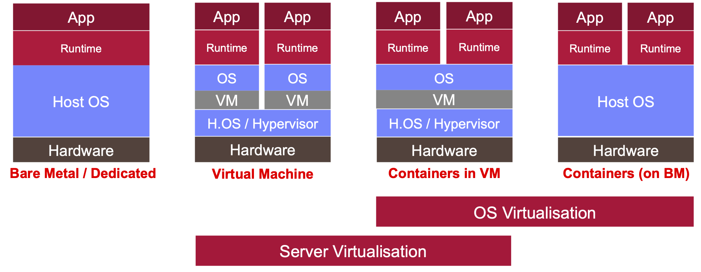

# Containerisation and Virtualization

## Insight 1. OS and Server virtualization

Virtualization, in the context of server and operating system (OS) virtualization, is a technology that allows multiple virtual instances or environments to run on a single physical server or host machine. This approach offers various benefits, including improved resource utilization, isolation between virtual environments, and greater flexibility in managing and deploying applications.

Here's a detailed explanation of server and OS virtualization:

### Server Virtualization

Server virtualization involves partitioning a physical server into multiple virtual servers, each with its own isolated operating system, applications, and resources. These virtual servers, often referred to as virtual machines (VMs), act as independent entities and can run different operating systems or applications simultaneously on the same physical hardware. Here are some key aspects of server virtualization:

- Hypervisor: A hypervisor (also known as a virtual machine monitor or VMM) is a software or firmware layer that manages and controls the virtualization process. It allows multiple VMs to share the underlying hardware resources without interference.

- Resource Allocation: Server virtualization allows administrators to allocate specific amounts of CPU, memory, storage, and network resources to each VM. This resource isolation prevents one VM from adversely affecting the performance of others.

- Isolation: VMs are isolated from one another. If one VM crashes or experiences issues, it typically does not impact the operation of other VMs on the same physical server.

- Hardware Consolidation: Server virtualization enables organizations to consolidate multiple physical servers onto a single physical host, reducing hardware costs and data center space requirements.

- Migration and Portability: VMs can be easily migrated between physical servers, making it convenient to perform maintenance, load balancing, and disaster recovery.

- Snapshot and Cloning: VMs can be snapshotted or cloned, allowing for quick backups and the rapid deployment of identical virtual environments.

- Testing and Development: Virtualization is valuable for software development and testing, as it allows developers to create and test in isolated environments that mimic production setups.

- Cloud Computing: Virtualization is a fundamental technology underlying cloud computing services, enabling cloud providers to offer flexible, scalable resources to customers.

### Operating System Virtualization

Operating system virtualization, often referred to as containerization or container-based virtualization, is a lighter-weight form of virtualization that virtualizes the OS at the application level. Instead of creating multiple VMs with separate OS instances, containers share the host OS kernel and resources while maintaining isolation at the application level. Here are some key aspects of OS virtualization:

- Containers: Containers are lightweight, portable environments that package an application and its dependencies. They are isolated from one another and run on the same host OS.

- Efficiency: OS virtualization is more efficient in terms of resource utilization compared to traditional VMs because containers share the host OS kernel and require fewer system resources.

- Rapid Deployment: Containers can be deployed quickly, making them ideal for microservices architectures and scalable applications.

- Consistency: Containers ensure consistent behavior across different environments (development, testing, production) since they include all required dependencies.

- Orchestration: Container orchestration platforms like Kubernetes can manage the deployment, scaling, and monitoring of containerized applications.

- DevOps Practices: OS virtualization aligns well with DevOps practices, as it enables developers and operations teams to work with identical environments and automate deployment processes.

In summary, both server virtualization and OS virtualization provide methods for maximizing resource utilization, improving scalability, and enhancing the management of applications and services in modern IT environments. The choice between these approaches depends on specific use cases, performance requirements, and management preferences.

## Insight 2. Hypervisors and VMM examples

A hypervisor, also known as a Virtual Machine Monitor (VMM), is a fundamental component of virtualization technology that allows multiple virtual machines (VMs) to run on a single physical server or host machine. Hypervisors provide an abstraction layer between the physical hardware and the virtual machines, enabling the efficient sharing of resources and isolation between VMs. OpenStack and VMware ESXi are two examples of hypervisor technologies, each serving different purposes in the world of virtualization:

- Hypervisor in General:

Definition: A hypervisor is software, firmware, or hardware that creates and manages virtual machines. It abstracts and partitions the underlying physical hardware resources, such as CPU, memory, storage, and network, to allocate them to multiple VMs.
Types of Hypervisors:
There are two main types of hypervisors:

- Type 1 Hypervisor (Bare-Metal Hypervisor):

This type runs directly on the physical hardware without the need for an underlying operating system. It provides high performance and is typically used in enterprise environments. VMware ESXi is an example of a Type 1 hypervisor.

- Type 2 Hypervisor (Hosted Hypervisor)

This type runs on top of a standard operating system and is often used for development, testing, or desktop virtualization. Examples include Oracle VirtualBox and VMware Workstation.

Now, let's specifically discuss OpenStack and VMware ESXi:

### OpenStack

- Type: 
OpenStack is not a traditional hypervisor but rather a cloud computing platform that includes various components for managing and provisioning virtual resources, including compute, storage, and networking resources.

- Role: OpenStack provides the framework for creating and managing cloud environments. Within OpenStack, the "Nova" component is responsible for managing compute resources, which involves interaction with hypervisors. It supports various hypervisors, including KVM, Xen, VMware, and more.

- Use Case: OpenStack is commonly used for building private and public clouds, enabling organizations to offer Infrastructure as a Service (IaaS) to their users. It manages the underlying hypervisors and virtual machine instances.

### VMware ESXi

- Type: VMware ESXi is a Type 1 hypervisor.

- Role: ESXi is designed to be installed directly on physical servers and provides a robust and efficient virtualization platform. It manages and monitors VMs running on the host hardware.

- Use Case: VMware ESXi is widely used in enterprise environments for server virtualization. It allows organizations to consolidate multiple workloads onto a single physical server while maintaining high levels of performance, availability, and management features.

In summary, a hypervisor is a critical component in virtualization technology that enables the creation and management of virtual machines. OpenStack is a cloud computing platform that incorporates a hypervisor component (e.g., Nova) to manage compute resources in a cloud environment. VMware ESXi, on the other hand, is a standalone Type 1 hypervisor designed for server virtualization in enterprise data centers. Both play important roles in modern virtualization and cloud computing ecosystems, but they serve different purposes and have distinct use cases.

## Insight 3. Docker

Docker is a containerization platform that allows you to package, distribute, and run applications and their dependencies in isolated containers. Containerization is a lightweight form of virtualization that has gained widespread popularity for its ability to simplify application deployment, improve resource utilization, and enhance development and operations workflows. Here's an overview of Docker containerization:

1. Containers:

Definition: Containers are lightweight, standalone executable packages that contain everything needed to run a piece of software, including the code, runtime, system libraries, and settings.
Isolation: Containers provide process and file system isolation, allowing multiple containers to run on the same host with minimal interference.
Consistency: Containers ensure consistent behavior across different environments (development, testing, production) by bundling all dependencies into a single unit.

2. Docker:

Docker Engine: Docker provides a platform for creating and managing containers. The Docker Engine is the core component responsible for building, running, and managing containers.
Docker Hub: Docker Hub is a public registry that hosts a vast collection of pre-built container images that can be used as a starting point for your own containers.
Docker Compose: Docker Compose is a tool for defining and running multi-container applications. It allows you to specify the services, networks, and volumes needed for your application in a single YAML file.
Docker Swarm and Kubernetes: Docker can be integrated with orchestration tools like Docker Swarm or Kubernetes to manage containerized applications at scale, including load balancing, scaling, and high availability.

3. Benefits of Docker Containerization:

- Portability: Docker containers can run consistently on any system that supports Docker, regardless of the underlying infrastructure. This portability simplifies deployment across different environments.
- Resource Efficiency: Containers share the host OS kernel, which makes them lightweight and resource-efficient compared to traditional virtual machines (VMs).
- Isolation: Containers provide process and file system isolation, preventing conflicts between applications running on the same host.
- Rapid Deployment: Containers can be created and deployed quickly, making them ideal for microservices architectures and continuous integration/continuous deployment (CI/CD) pipelines.
- Version Control: Container images can be versioned, making it easy to roll back to previous versions if issues arise.
- Scalability: Containers can be easily scaled up or down to accommodate changes in traffic or demand.
- Security: Containers can be run with fine-grained access controls and are isolated from the host and other containers, enhancing security.

4. Use Cases:

- Application Packaging: Docker is commonly used for packaging applications and their dependencies into containers for easy distribution and deployment.
- Microservices: Docker is well-suited for building and deploying microservices-based architectures, where each component of an application is containerized and independently scalable.
- DevOps and CI/CD: Docker facilitates DevOps practices by streamlining development, testing, and deployment processes through containerization and automation.
- Hybrid Cloud: Docker containers are portable, making them an excellent choice for hybrid and multi-cloud deployments.

In summary, Docker containerization simplifies application deployment and management by encapsulating applications and their dependencies into lightweight, portable containers. These containers offer consistent behavior, improved resource utilization, and enhanced development and operations workflows, making Docker a valuable tool in modern software development and deployment.