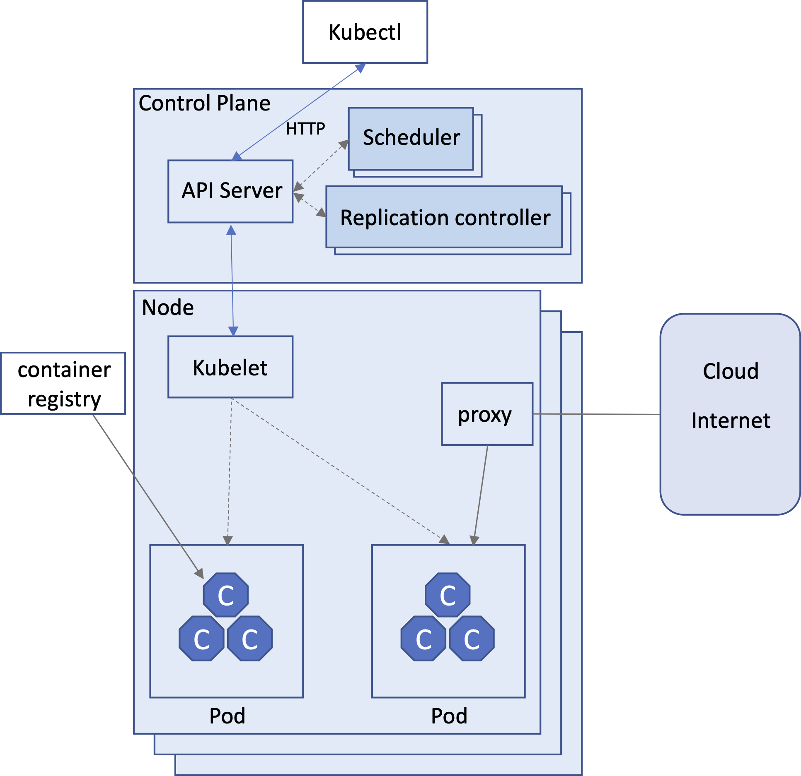
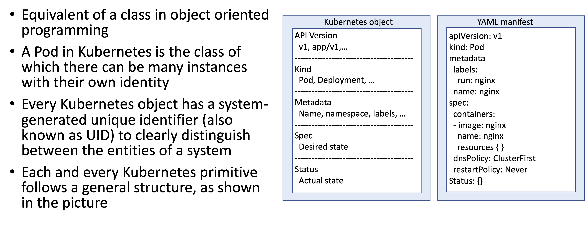

# Kubernetes Orchestration

## Insight 1. Kubernetes overview

Kubernetes, often abbreviated as K8s, is an open-source container orchestration platform designed to automate the deployment, scaling, management, and operation of containerized applications. It was originally developed by Google and is now maintained by the Cloud Native Computing Foundation (CNCF). Kubernetes is widely used for managing containerized workloads in various environments, from on-premises data centers to cloud infrastructure. Here's an overview of Kubernetes:



Key Components and Concepts:

- Node: A node is a physical or virtual machine that runs containers. Nodes are the worker machines in a Kubernetes cluster.

- Cluster: A Kubernetes cluster is a set of nodes (machines) that work together to run containerized applications. It includes a control plane (master) and one or more worker nodes.

- Control Plane: The control plane is responsible for managing and orchestrating the cluster. It includes components like the API server, etcd (a distributed key-value store for configuration data), controller manager, and scheduler.

- Pod: The smallest deployable unit in Kubernetes is a pod. A pod can contain one or more containers that share the same network namespace and storage volumes. Containers within a pod can communicate with each other using localhost.

- Service: A service provides a stable network endpoint for accessing a set of pods. It allows applications to discover and communicate with each other, even as pods are dynamically created or scaled.

- ReplicaSet: A ReplicaSet ensures that a specified number of pod replicas are running at all times. It can automatically scale the number of replicas up or down based on desired state.

- Deployment: A Deployment is a higher-level abstraction that manages ReplicaSets. It allows you to declaratively define the desired state of an application, and Kubernetes will make the necessary changes to achieve that state.

- Namespace: Namespaces provide a way to divide a cluster into multiple virtual clusters, each with its own set of resources and policies. They help with resource isolation and organization.

- ConfigMap and Secret: ConfigMaps and Secrets are used to store configuration data and sensitive information, respectively, and make them available to pods without hardcoding them.

- Ingress: An Ingress controller manages external access to services within the cluster, typically for HTTP and HTTPS traffic. It can route traffic to different services based on URL paths or hostnames.

- Volume: Volumes provide a way to persist data beyond the lifetime of a pod. Kubernetes supports various types of volumes, including network storage solutions.

## Insight 2. Kubernetes key features and benefits

- Orchestration: Kubernetes automates the deployment and scaling of containerized applications, reducing manual intervention and human errors.

- Scalability: Kubernetes can scale applications horizontally by adding or removing pod replicas as needed to handle varying levels of traffic.

- Self-Healing: Kubernetes monitors the health of applications and automatically replaces or reschedules unhealthy pods to maintain the desired state.

- Rolling Updates and Rollbacks: Kubernetes supports rolling updates, allowing applications to be updated without downtime. If issues arise, rollbacks can be performed quickly.

- Resource Management: Kubernetes manages resource allocation, ensuring that applications get the necessary CPU and memory resources.

- Multi-Cloud and Hybrid Cloud: Kubernetes is cloud-agnostic, allowing applications to be deployed consistently across different cloud providers or on-premises infrastructure.

- Ecosystem: Kubernetes has a rich ecosystem of extensions, tools, and plugins that enhance its functionality and adapt it to various use cases.

Kubernetes has become the de facto standard for container orchestration and is widely adopted in the containerized application development and deployment ecosystem. It provides a powerful and flexible platform for managing containerized workloads, making it easier to build, deploy, and scale applications in modern computing environments.

## Insight 3. Pod configuration example

Configuring a Kubernetes (K8s) Pod involves defining the desired state of the Pod, including the container(s) it will run, resource requirements, environment variables, volumes, and various settings. You can define a Pod's configuration using a Kubernetes manifest file written in YAML or JSON format.



Below, we provide a step-by-step guide to configuring a K8s Pod:

- Create a Kubernetes Manifest File:
Start by creating a YAML or JSON file that describes the configuration of the Pod. You can use a text editor or an integrated development environment (IDE) to create the file. For example, let's call it my-pod.yaml.

- Define the Pod's Metadata:
In your my-pod.yaml file, specify metadata for the Pod, including the name and any labels or annotations you want to associate with it. Here's an example:

```yaml
apiVersion: v1
kind: Pod
metadata:
  name: my-pod
  labels:
    app: my-app
```

- Specify the Container(s):
Inside the Pod configuration, define the container(s) you want to run. Specify the image, command, and arguments for each container. Here's an example of a Pod with a single container:

```yaml
spec:
  containers:
    - name: my-container
      image: nginx:latest
      ports:
        - containerPort: 80
```

In this example, we're using the Nginx container image and exposing port 80.

- Set Resource Requirements:
You can specify CPU and memory resource requests and limits for the container(s) to ensure resource isolation and proper allocation. Here's an example:

```yaml
spec:
  containers:
    - name: my-container
      image: nginx:latest
      resources:
        requests:
          memory: "256Mi"
          cpu: "100m"
        limits:
          memory: "512Mi"
          cpu: "200m"
```

- Define Environment Variables:
If your application requires environment variables, you can set them using the env field. Here's an example:

```yaml
spec:
  containers:
    - name: my-container
      image: nginx:latest
      env:
        - name: MY_ENV_VAR
          value: "my-value"
```

- Mount Volumes:
If your application needs to access external data or configuration files, you can define volumes and mount them into the container(s). Here's an example:

```yaml
spec:
  containers:
    - name: my-container
      image: nginx:latest
      volumeMounts:
        - name: my-volume
          mountPath: /app/data
  volumes:
    - name: my-volume
      hostPath:
        path: /host/data
```

In this example, we're mounting a hostPath volume into the container at /app/data.

- Save and Apply the Manifest:
Save your my-pod.yaml file. To create the Pod, apply the configuration to your Kubernetes cluster using the kubectl apply command:

```bash
kubectl apply -f my-pod.yaml
```

Kubernetes will create the Pod based on the configuration you provided.

- Verify the Pod:
You can check the status of the Pod by running:

```bash
kubectl get pods
```

You should see your Pod listed with its current status.

- Inspect Logs:
To view the logs generated by the container(s) within the Pod, you can use the following command:

```bash
kubectl logs my-pod
```

Replace my-pod with the name of your Pod.

Interact with the Pod:
You can interact with the Pod by executing commands inside it. For example, to open a shell in the container, use the following command:

```bash
kubectl exec -it my-pod -- /bin/bash
```

Replace /bin/bash with the appropriate shell for your container.

That's it! You've configured and deployed a Kubernetes Pod. You can further manage and monitor your Pod using various kubectl commands and Kubernetes resources like Services, Deployments, and StatefulSets, depending on your application's requirements.
