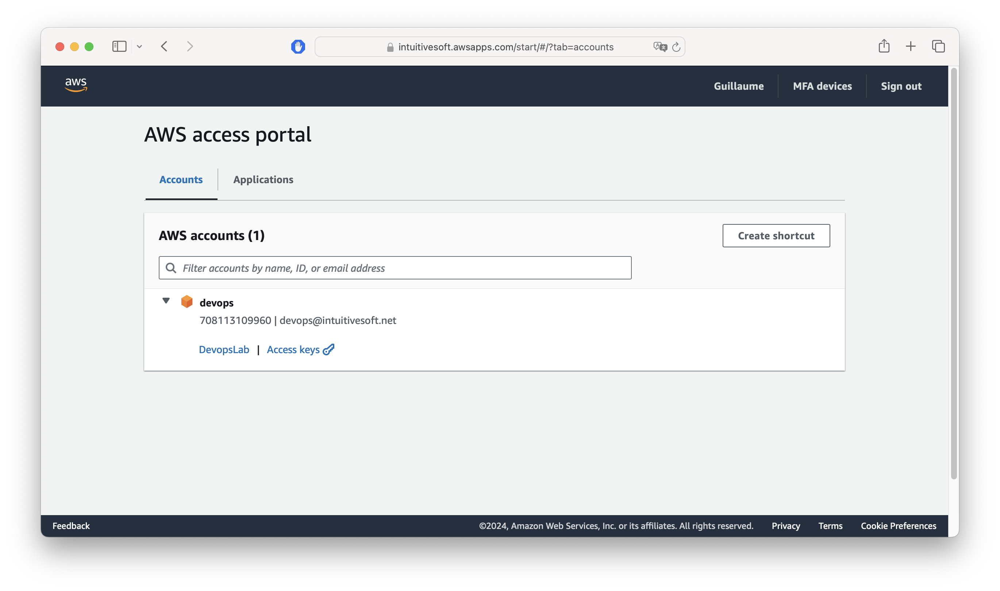
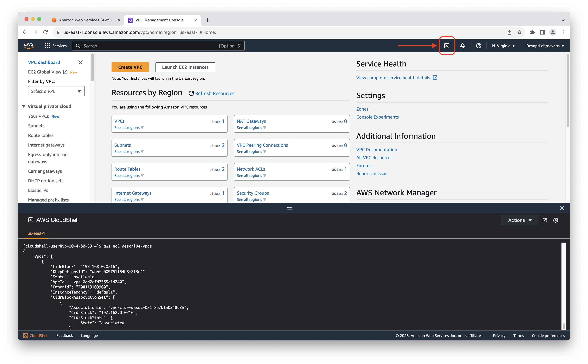

# AWS CLI on Linux

The AWS Command Line Interface (AWS CLI) is an open source tool that enables you to interact with AWS services using commands in your command-line shell. With minimal configuration, the AWS CLI enables you to start running commands that implement functionality equivalent to that provided by the browser-based AWS Management Console from the command prompt in your terminal program. 
It's technically a wrapper around AWS REST API.

Terraform will use the configuration file of the AWS CLI to retrieve the access key when performing calls to AWS API.

## Task 1. Install AWS CLI

```bash 
sudo apt install unzip
```

```bash
curl "https://awscli.amazonaws.com/awscli-exe-linux-x86_64.zip" -o "awscliv2.zip"
```

```bash 
unzip awscliv2.zip
```

```bash 
sudo ./aws/install --update
```

## Task 2. Test you AWS CLI installation

```bash
aws --version
```

You should have a result similar to:

```console
aws-cli/2.13.9 Python/3.11.4 Linux/5.15.0-1040-aws exe/x86_64.ubuntu.20 prompt/off
```

## Task 3. Retrieve your AWS secrets

You need to specify application credentials for authentication and permissions on the AWS API.

**- Task 3.1 -**

Connect to the training SSO portal : 

 [__https://intuitivesoft.awsapps.com/start#/__](https://intuitivesoft.awsapps.com/start#/)

Select your training AWS account and click the link  `Command Line or programmatic access` to retrieve your credentials.




## Task 4. Verify your access to AWS via CLI

```bash
aws sts get-caller-identity
```

You should have an output similar to :

```json
{
    "UserId": "AROA2JXWUSPEDW7XVV72X:devops",
    "Account": "708113109960",
    "Arn": "arn:aws:sts::708113109960:assumed-role/AWSReservedSSO_DevopsLab_a5ad8dc258100c0a/devops"
}
```

The full documentation of AWS CLI usage can be found here : [AWS Documentation : AWS CLI usage](https://docs.aws.amazon.com/cli/latest/userguide/cli-chap-using.html)

## Task 5. Retrieve your VPC information

**- Task 5.1 -**

```bash
aws ec2 describe-vpcs 
```

You should have an output similar to :

```json
{
  "Vpcs": [
    {
      "CidrBlock": "192.168.0.0/16",
      "DhcpOptionsId": "dopt-02cb9007f1d29d0fc",
      "State": "available",
      "VpcId": "vpc-REDACTED",
      "OwnerId": "REDACTED",
      "InstanceTenancy": "default",
      "CidrBlockAssociationSet": [
        {
          "AssociationId": "vpc-cidr-assoc-0e933f3263a8b89b7",
          "CidrBlock": "192.168.0.0/16",
          "CidrBlockState": {
            "State": "associated"
  [...]
```

**- Task 5.2 -**

You can filter on tag by using the `--filters` option.

On user defined tag :

```bash
aws ec2 describe-vpcs --filters Name=tag:lab-id,Values=pod1 
```

Or object Name :
```bash
aws ec2 describe-vpcs --filters Name=tag:Name,Values=pod1-vpc
```

## Task 6. Retrieve your EC2 instances 

Use `--filters` option to filter to your instance name or tag.

```bash
aws ec2 describe-instances
```

You should have an output similar to :

```json
{
    "Reservations": [
        {
            "Groups": [],
            "Instances": [
                {
                    "AmiLaunchIndex": 0,
                    "ImageId": "ami-08a52ddb321b32a8c",
                    "InstanceId": "i-04342ad763fc1a659",
                    "InstanceType": "t2.micro",
                    "KeyName": "pod1-key",
                    "LaunchTime": "2023-08-14T17:22:03+00:00",
                    "Monitoring": {
                        "State": "disabled"
                    },
                    "Placement": {
                        "AvailabilityZone": "us-east-1c",
                        "GroupName": "",
                        "Tenancy": "default"
                    },
                    "PrivateDnsName": "ip-192-168-2-133.ec2.internal",
                    "PrivateIpAddress": "192.168.2.133",
                    "ProductCodes": [],
                    "PublicDnsName": "",
                    "PublicIpAddress": "REDACTED",
                    "State": {
                        "Code": 16,
                        "Name": "running"
                    },
                    "StateTransitionReason": "",
                    "SubnetId": "subnet-0e09b804de9f67b3d",
                    "VpcId": "vpc-REDACTED",
                    "Architecture": "x86_64",
                    "BlockDeviceMappings": [
                        {
                            "DeviceName": "/dev/xvda",
                            "Ebs": {
                                "AttachTime": "2023-08-14T17:22:04+00:00",
                                "DeleteOnTermination": true,
                                "Status": "attached",
                                "VolumeId": "vol-05ec19fedb84536ad"
                            }
                        }
                    ],
                    "ClientToken": "1461cf52-3347-422c-9671-d9ad607ad0fe",
                    "EbsOptimized": false,
                    "EnaSupport": true,
                    "Hypervisor": "xen",
                    "NetworkInterfaces": [
                        {
                            "Association": {
                                "IpOwnerId": "amazon",
                                "PublicDnsName": "",
                                "PublicIp": "54.86.98.9"
                            },
                            "Attachment": {
                                "AttachTime": "2023-08-14T17:22:03+00:00",
                                "AttachmentId": "eni-attach-02a22e4f73b6fdaac",
                                "DeleteOnTermination": true,
                                "DeviceIndex": 0,
                                "Status": "attached",
                                "NetworkCardIndex": 0
                            },
                            "Description": "",
                            "Groups": [
                                {
                                    "GroupName": "pod1-sg",
                                    "GroupId": "sg-0944e3f66c2891810"
                                }
                            ],
                            "Ipv6Addresses": [],
                            "MacAddress": "0a:b7:f7:d0:32:51",
                            "NetworkInterfaceId": "eni-06abd3f26aa187bba",
                            "OwnerId": "708113109960",
                            "PrivateIpAddress": "192.168.2.133",
                            "PrivateIpAddresses": [
                                {
                                    "Association": {
                                        "IpOwnerId": "amazon",
                                        "PublicDnsName": "",
                                        "PublicIp": "REDACTED"
                                    },
                                    "Primary": true,
                                    "PrivateIpAddress": "192.168.2.133"
                                }
                            ],
                            "SourceDestCheck": true,
                            "Status": "in-use",
                            "SubnetId": "subnet-0e09b804de9f67b3d",
                            "VpcId": "vpc-0ed2cfd7555c1d240",
                            "InterfaceType": "interface"
                        }
                    ],
                    "RootDeviceName": "/dev/xvda",
                    "RootDeviceType": "ebs",
                    "SecurityGroups": [
                        {
                            "GroupName": "pod1-sg",
                            "GroupId": "sg-0944e3f66c2891810"
                        }
                    ],
                    "SourceDestCheck": true,
                    "Tags": [
                        {
                            "Key": "Name",
                            "Value": "test-instance"
                        }
                    ],
                    "VirtualizationType": "hvm",
                    "CpuOptions": {
                        "CoreCount": 1,
                        "ThreadsPerCore": 1
                    },
                    "CapacityReservationSpecification": {
                        "CapacityReservationPreference": "open"
                    },
                    "HibernationOptions": {
                        "Configured": false
                    },
                    "MetadataOptions": {
                        "State": "applied",
                        "HttpTokens": "required",
                        "HttpPutResponseHopLimit": 2,
                        "HttpEndpoint": "enabled",
                        "HttpProtocolIpv6": "disabled",
                        "InstanceMetadataTags": "disabled"
                    },
                    "EnclaveOptions": {
                        "Enabled": false
                    },
                    "BootMode": "uefi-preferred",
                    "PlatformDetails": "Linux/UNIX",
                    "UsageOperation": "RunInstances",
                    "UsageOperationUpdateTime": "2023-08-14T17:22:03+00:00",
                    "PrivateDnsNameOptions": {
                        "HostnameType": "ip-name",
                        "EnableResourceNameDnsARecord": false,
                        "EnableResourceNameDnsAAAARecord": false
                    },
                    "MaintenanceOptions": {
                        "AutoRecovery": "default"
                    },
                    "CurrentInstanceBootMode": "legacy-bios"
                }
            ],
            "OwnerId": "REDACTED",
            "ReservationId": "r-REDACTED"
        }
    ]
}
```

## Task 8. Retrieve Instance AMI information

From the previous command output we need to retrieve the `ImageId` information the response payload.

To do it programaticaly we can leverage linux JSON utility tool `jq` with a filter.

**- Task 8.1 -**

Analyse payload output

```json
{
    "Reservations": [                                     # First element of the Reservations list
        {
            "Groups": [],
            "Instances": [                                # First element of the Instances list
                {
                    "AmiLaunchIndex": 0,
                    "ImageId": "ami-08a52ddb321b32a8c",   # Key is ImageId
                    "InstanceId": "i-04342ad763fc1a659",

  [...]
```

The filter is : `.Reservations[0].Instances[0].ImageId`


**- Task 8.2 -**

Re-use previous request and pipe ( `|` ) its output to `jq` with the crafted filter.

Replace `REDACTED` with the appropriate tag value or instance identifier you are using.

```bash
aws ec2 describe-instances --filters Name=tag:Name,Values=REDACTED --output json | jq -r '.Reservations[0].Instances[0].ImageId'
```

You should have an output similar to :

```
ami-053b0d53c279acc90
```

## Task 9. Retrieve information on the AMI 

```bash
aws ec2 describe-images --region us-east-1 --image-ids ami-053b0d53c279acc90
```

```json
{
    "Images": [
        {
            "Architecture": "x86_64",
            "CreationDate": "2023-05-16T03:38:03.000Z",
            "ImageId": "ami-053b0d53c279acc90",
            "ImageLocation": "amazon/ubuntu/images/hvm-ssd/ubuntu-jammy-22.04-amd64-server-20230516",
            "ImageType": "machine",
            "Public": true,
            "OwnerId": "099720109477",
            "PlatformDetails": "Linux/UNIX",
            "UsageOperation": "RunInstances",
            "State": "available",
            "BlockDeviceMappings": [
                {
                    "DeviceName": "/dev/sda1",
                    "Ebs": {
                        "DeleteOnTermination": true,
                        "SnapshotId": "snap-0d3283808e9f92122",
                        "VolumeSize": 8,
                        "VolumeType": "gp2",
                        "Encrypted": false
                    }
                },
                {
                    "DeviceName": "/dev/sdb",
                    "VirtualName": "ephemeral0"
                },
                {
                    "DeviceName": "/dev/sdc",
                    "VirtualName": "ephemeral1"
                }
            ],
            "Description": "Canonical, Ubuntu, 22.04 LTS, amd64 jammy image build on 2023-05-16",
            "EnaSupport": true,
            "Hypervisor": "xen",
            "ImageOwnerAlias": "amazon",
            "Name": "ubuntu/images/hvm-ssd/ubuntu-jammy-22.04-amd64-server-20230516",
            "RootDeviceName": "/dev/sda1",
            "RootDeviceType": "ebs",
            "SriovNetSupport": "simple",
            "VirtualizationType": "hvm",
            "BootMode": "legacy-bios",
            "DeprecationTime": "2025-05-16T03:38:03.000Z"
        }
    ]
}
```

## Task 10. Lifecycle of your instance

**- Task 10.1 -** 

Retrieve your instance id

```bash
aws ec2 describe-instances --filters Name=tag:Name,Values=REDACTED --output json | jq -r '.Reservations[0].Instances[0].InstanceId'
```

You should have an output similar to :

```console
i-02d46929fca25538b
```

**- Task 10.2 -**

Stop/Start/Terminate your instance

Replace `REDACTED` with the appropriate tag value or instance identifier you are using.

```bash
aws ec2 stop-instances --instance-ids REDACTED
aws ec2 start-instances --instance-ids REDACTED
aws ec2 terminate-instances --instance-ids REDACTED
```

## Task 11. AWS CloudShell

From the AWS Web Console you can access the AWS Cloud shell CLI.



---