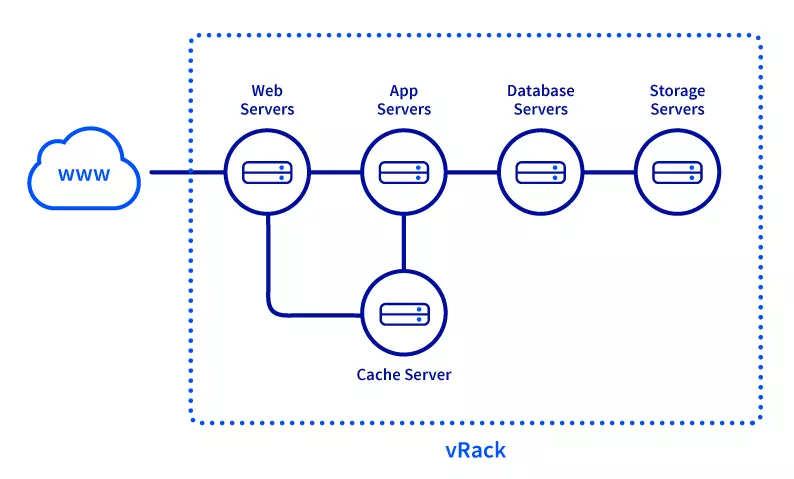
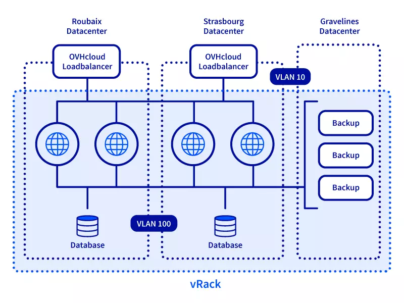
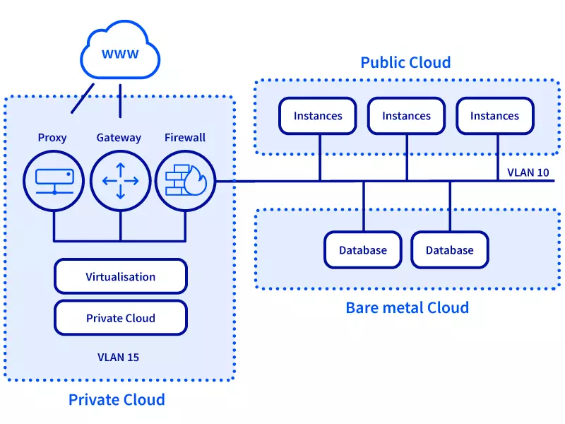
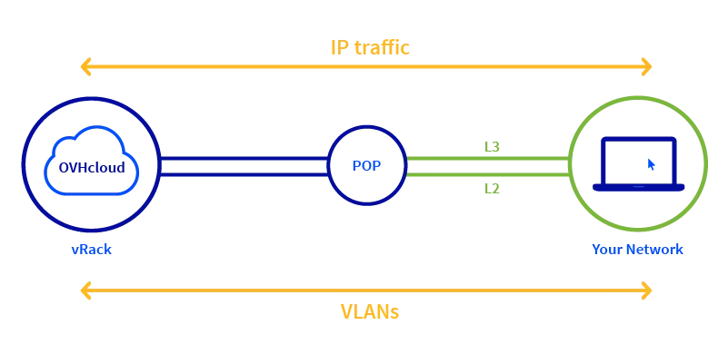
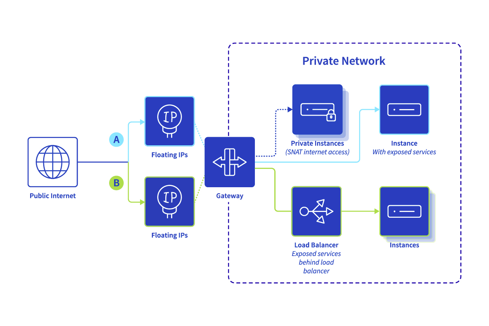
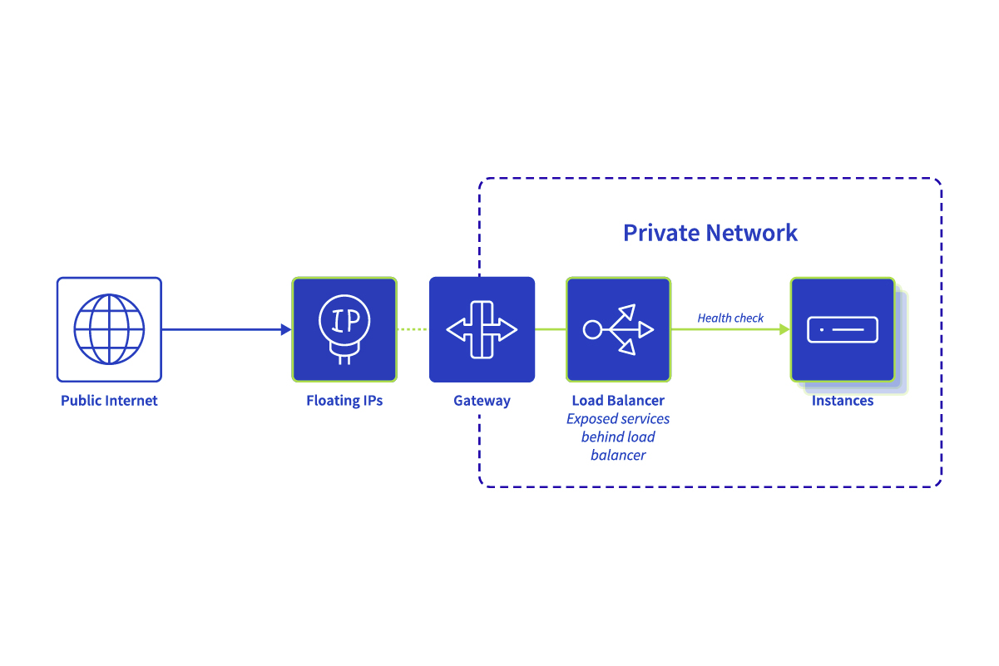

# OVH Cloud Overview

## Insight 1. OVH Cloud features

OVH provides a range of cloud services to businesses and individuals. They are known for their focus on providing a high-performance, reliable, and cost-effective cloud infrastructure. OVH's cloud architecture and services include:

- **Public Cloud**: OVH offers a public cloud platform that includes virtual machines (instances) with various configurations, allowing customers to run applications, websites, and other workloads. These instances can be provisioned quickly and come with options for different computing power, memory, and storage capacities.

- **Private Cloud**: OVH provides a private cloud solution that enables businesses to create their own isolated cloud environment on OVH's infrastructure. This is suitable for organizations that require more control and customization over their cloud resources.

- **Object Storage**: OVH offers scalable and redundant object storage services similar to Amazon S3. This allows users to store and retrieve large amounts of unstructured data, such as images, videos, backups, and logs.

- **Block Storage**: OVH's block storage services enable users to attach additional storage volumes to their virtual machines. This is useful for expanding storage capacity without having to resize the entire instance.

- **Load Balancing**: OVH provides load balancing solutions to distribute incoming network traffic across multiple instances or resources, ensuring high availability and better performance.

- **Networking**: OVH's network services include features like Virtual Private Cloud (VPC) for isolating and connecting resources securely, IP failover for high availability, and DDoS protection to mitigate distributed denial-of-service attacks.

- **Managed Kubernetes**: OVH offers a managed Kubernetes service that allows users to deploy, manage, and scale containerized applications using Kubernetes orchestration.

- **Database Services**: OVH provides managed database services, including options for MySQL, PostgreSQL, and NoSQL databases, making it easier for users to set up and operate databases without managing the underlying infrastructure.

- **Monitoring and Analytics**: OVH offers monitoring and analytics tools to help users monitor the performance of their applications and infrastructure, making it easier to identify and resolve issues.

- **Security Services**: OVH emphasizes security and offers services like firewalling, VPNs, and anti-DDoS protection to safeguard cloud resources from cyber threats.

- **Backup and Disaster Recovery**: OVH provides backup and disaster recovery solutions, allowing users to schedule backups of their data and applications and quickly restore them in case of data loss or system failures.

## Insight 2. Public Cloud Networking

### Public Cloud private networks

Public Cloud private networks are being created on top of a vRack - an OVHcloud service providing a global private network that can be assigned to a Public Cloud project.

The vRack is a private network that spreads across all OVHcloud data centers, allowing you to build a highly available or distributed worldwide infrastructure for your applications, to the data centers of your choice.

For more advanced use cases, every vRack can be clustered further with Layer-2 VLANs (up to 4000 VLANs are available per single vRack). A Public Cloud private network can be placed in each VLAN.

This way, a number of scenarios are possible.

- **Single-region private networks**: 

    Using a private network with different VLANs in different regions allows to split a broadcast domain into local regions. This use case can be selected for compatibility with some of the new network functions (e.g. Load Balancer, Gateway) or disaster recovery scenarios.

    

- **Multi-region private networks**:
 
    To achieve resource interconnectivity between regions, the same vRack/VLAN/subnet should be used to create a private network in each region. Please note that different DHCP IP ranges must be used in different regions. This type creates broadcast domains between regions which can be helpful in some cases, but it is not compatible with some of the new network services (e.g. Load Balancer, Gateway).

    

- **Private connectivity across different product lines**: 

    Resources from the Bare Metal Cloud or Hosted Private Cloud (dedicated and managed VMWare virtualization platform in the cloud) universes can be used together with Public Cloud services by leveraging the same vRack/VLAN for interconnectivity.

    

With our OVHcloud Connect hybrid connection solution, you can form a secure, high-performance link between your company network and the OVHcloud vRack.

### Connecting Public Cloud resources to the Internet

The OVHcloud infrastructure offers multiple ways to access the Internet or to expose Public Cloud resources to the Internet.

- **Public Mode**: A public IP is attached directly to the instance

    Public Cloud instances use public IP addresses which are attached to a public port for Internet access. As every instance is exposed to the Internet separately, security must be addressed on every single instance.

    In this mode you can still connect instances to private networks for interconnection purposes.

    OVHcloud Public IP addresses directly attached to instances in Public Mode are not designed to be moved to other instances or network services. For infrastructure-agnostic usage, the suggested way is to use a Floating IP address that is linked to your service but not the specific instance.

    Keep in mind that some services (e.g. Load Balancer, Gateway) are not compatible with Public Mode instances.

- **Private mode**: The instance remains private (unless a Floating IP or a Load Balancer is attached)

    In this mode, a newly created instance does not have a public IP attached to any port. The instance will remain fully private (no public connectivity) unless:

    - A Floating IP address is attached to it (using Gateway) for inbound traffic use cases, for example when services need to be exposed publicly.
    - Load Balancer with Floating IP is configured for inbound traffic, so services located on the instance may be exposed to the Internet.
    - SNAT Gateway is configured in the private network for outbound access use cases. This will enable Internet access only without exposing any private resources.

    In private mode, users can define a single entry point (a Gateway) that is managing inbound/outbound traffic rules. This simplifies security management: There is no need to monitor all resources for proper public traffic access rules.

    If you want to access your fully private instance from the Internet, the following options are available:

    - You can create an "SSH proxy instance" (also known as a "jump host") with a Floating IP public address on one side and a private network (the one of the private instance) on the other side. Log in to this host, then log in to the private instance.
    - You can temporarily assign a Floating IP to such an instance for the time of access.

- **Public Cloud Gateway (with SNAT)**

    If connectivity from a fully private instance to outside networks (Internet) is needed, then using Gateway with Source Network Address Translation (SNAT) is the appropriate method.

    The private IP address of your resource (instance) is being translated into a public one (allowing it to reach public resources). The answer will be in turn translated and forwarded properly to your resource. This way, the public IP can be shared across a number of services.

    It is important to note that a resource (instance) remains fully private in this scenario. No kind of access initiated from the outside network is possible.

    

- **Load Balancer inside private networking**

    OVHcloud offers the Octavia Load Balancer as part of the Public Cloud ecosystem. This provides the most flexibility for scaling your applications.

    The Public Cloud Load Balancer remains fully private, therefore it needs a Gateway service to access the public network and Floating IP for outbound service exposure.

    

### Public IP addresses

- **OVHcloud Floating IP** for Public Cloud

    OVHcloud Floating IP provides infrastructure-agnostic, cloud-native, flexible public IP addresses for automation use cases. It can be used to expose your Public Cloud services to the Internet by mapping it to either your private instance or a network function (a Load Balancer for example). It requires a Gateway to work (for mapping between public and private IPs) and it is only supporting IP version 4.

    With fully automated assignments via DHCP and a pay-as-you-go billing model, the Floating IP service is designed for automated usage (e.g. Ansible, Terraform).

    The main purpose of Floating IP is web service exposure to the Internet. This may pertain to a service on a single instance or a cluster of instances with a Load Balancer in front. Floating IP is thus ideal for application version testing and CI/CD automation (e.g. blue-green, canary, active fallback deployments).

- **OVHcloud Additional IP** (previously labelled as Failover IP)

    OVHcloud Additional IP is another type of service-agnostic public IP address. Additional IP addresses allow you to switch between attached services, but compared to Floating IPs they are more static as they need additional configuration directly on the host. Therefore they are more suited to interconnect OVHcloud services from different product lines.

    For example, you may apply a hybrid-cloud concept based on a mix of Bare Metal servers and Public Cloud resources or other OVHcloud services.
