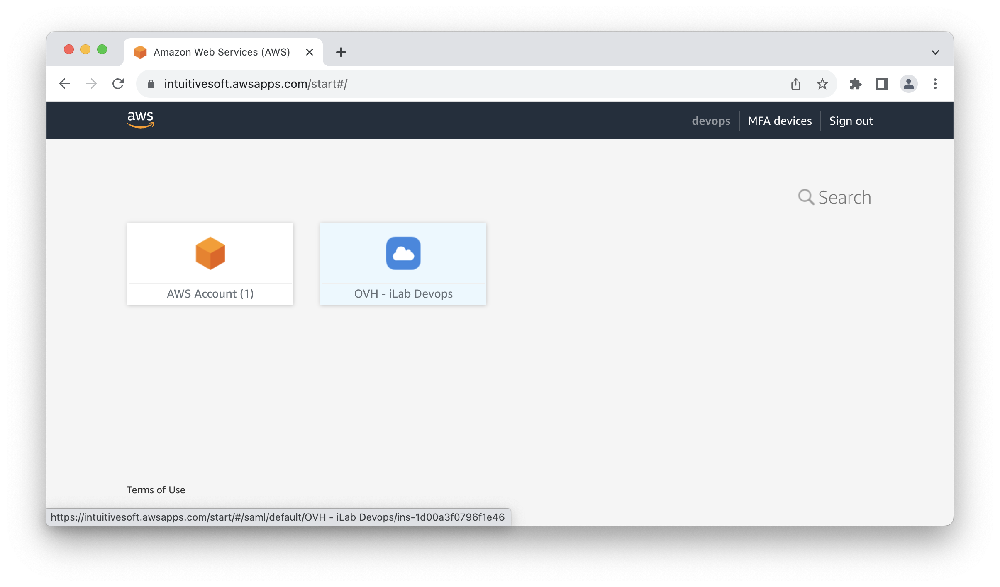
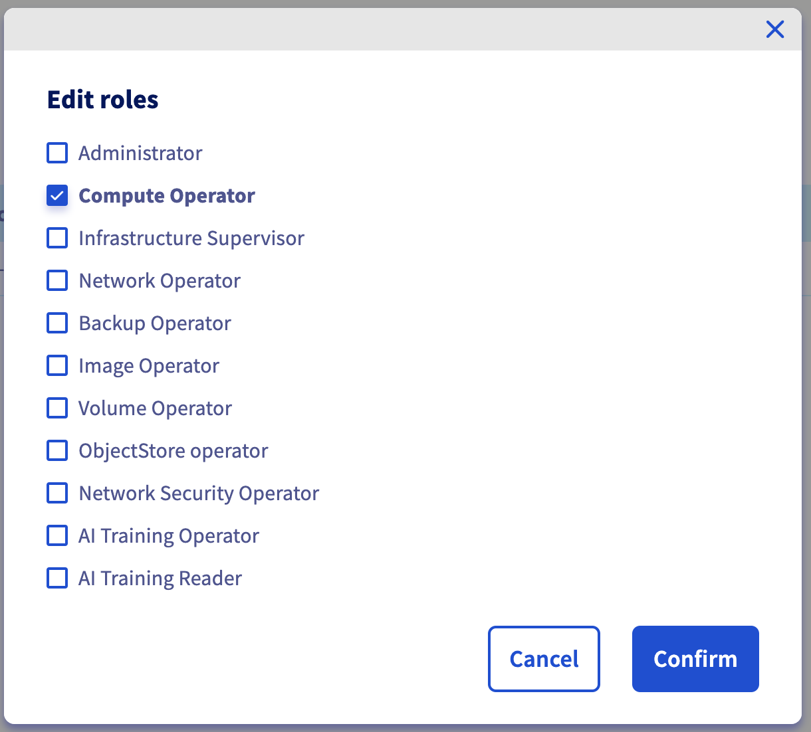
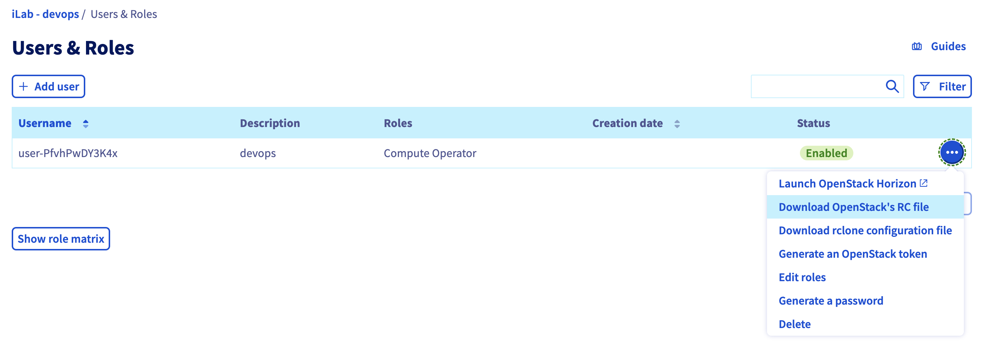

# OVH Cloud Terraform Lab

## Task 1. Login to OVH management console 

**- Task 1.1 -**

Connect to the OVH management console using the training SSO portal : 

 [__https://intuitivesoft.awsapps.com/start#/__](https://intuitivesoft.awsapps.com/start#/)

Select your training OVH account and click the link `iLab Devops` to get access to the account main page.



**- Task 1.2 -**

Enter the training OVH account ID : **`lg698057-ovh/idp`** with **no password**


## Task 2. Create Openstack User

**- Task 2.1 -**

Navigate the `Users & Roles` section and add a new user.

**- Task 2.1 -**

Select `Compute Operator` as roles for you user



**- Task 2.2 -**

Retrieve User credentials or re-generate its password.


**- Task 2.3 -**

Download your environement Openstack RC file.



An OpenStack RC (Resource Configuration) file is a script that contains environment variables and configuration settings needed to interact with an OpenStack cloud using the command-line tools and API. It is a shell script that you source into your shell session to set up the necessary environment variables for authenticating and interacting with the OpenStack services API. 

Terraform will use it to authenticate towards OVH hosted Openstack. 

The file contains those informations : 

```shell
# To use an Openstack cloud you need to authenticate against keystone, which
# returns a **Token** and **Service Catalog**. The catalog contains the
# endpoint for all services the user/tenant has access to - including nova,
# glance, keystone, swift.
#
export OS_AUTH_URL=https://auth.cloud.ovh.net/v3
export OS_IDENTITY_API_VERSION=3

export OS_USER_DOMAIN_NAME=${OS_USER_DOMAIN_NAME:-"Default"}
export OS_PROJECT_DOMAIN_NAME=${OS_PROJECT_DOMAIN_NAME:-"Default"}


# With the addition of Keystone we have standardized on the term **tenant**
# as the entity that owns the resources.
export OS_TENANT_ID=1586f8130a454d16a1771f9299e0b070
export OS_TENANT_NAME="1792078060788642"

# In addition to the owning entity (tenant), openstack stores the entity
# performing the action as the **user**.
export OS_USERNAME="user-XXXXXXXXXX"

# With Keystone you pass the keystone password.
echo "Please enter your OpenStack Password: "
read -sr OS_PASSWORD_INPUT
export OS_PASSWORD=${OS_PASSWORD_INPUT}

# If your configuration has multiple regions, we set that information here.
# OS_REGION_NAME is optional and only valid in certain environments.
export OS_REGION_NAME="GRA11"
```

## Task 3. Login to OVH Public Cloud Horizon dashboard

Verify you can login Horizon Dashboard **[https://horizon.cloud.ovh.net/auth/login/](https://horizon.cloud.ovh.net/auth/login/)** using the username and credentials you generated

## Task 4. Configure Terraform Openstack Provider

**- Task 4.1 -**

Create a new working folder and put a file in it called ```provider.tf``` that contains the following contents:

```
terraform {                  
    required_providers {
        openstack = {
            source  = "terraform-provider-openstack/openstack"
            version = "~> 1.42.0"                   # Specify provider minimal version
        }
    }
}

# Configure the OpenStack provider hosted by OVHcloud
provider "openstack" {
  auth_url    = "https://auth.cloud.ovh.net/v3/"    # Authentication URL
  domain_name = "default"                           # Domain name - Always at 'default' for OVHcloud
  alias       = "ovh"                               # An alias
}
```

## Task 5. Generate a SSH key 

You will need a SSH key to authenticate to your OVH instances. You can re-use one you already have or generate a new one.

Generate a pub key from a .pem key :
```
ssh-keygen -y -f my-private-key.pem > my-private-key.pub
```

## Task 6. Create the Terraform main file

Create a Terraform file named `main.tf` that contains the following content :

```
# Creating an SSH key pair resource
resource "openstack_compute_keypair_v2" "test_keypair" {
  provider   = openstack.ovh                # Provider name declared in provider.tf
  name       = "openstack-cloud-key-pub"    # Name of the SSH key to use for creation
  public_key = file("~/.ssh/my-private-key.pub")  # Path to your SSH public key, need to generate one if doesn't exist
}

# Creating the instance
resource "openstack_compute_instance_v2" "test_terraform_instance" {
  name        = "terraform_instance"        # Instance name
  provider    = openstack.ovh               # Provider name
  image_name  = "Ubuntu 22.04"              # Image name Ubuntu 22.04
  flavor_name = "s1-2"                      # Instance type name
  # Name of openstack_compute_keypair_v2 resource named keypair_test
  key_pair    = openstack_compute_keypair_v2.test_keypair.name
  network {
    name      = "Ext-Net"                   # Adds the network component to reach your instance
  }
}

#Display Public IP Address allocated to instance
output "test_terraform_instance_ip" {
  value = openstack_compute_instance_v2.test_terraform_instance.network[0].fixed_ip_v4
}
```

## Task 7. Download Providers

In a terminal, go into the folder where you created main.tf and run the terraform init command:

```bash
terraform init
```

## Task 8. Authenticate toward OVH Openstack

In a terminal, locate your `openrc.sh` file and source it :

```bash
source openrc.sh
```

When instructed enter your user Openstack Password
```
Please enter your OpenStack Password: 
```
## Task 9. Plan your deployement

```bash
terraform plan
```

You should see a result like this:

```
Terraform used the selected providers to generate the
following execution plan. Resource actions are indicated
with the following symbols:
  + create

Terraform will perform the following actions:

  # openstack_compute_instance_v2.test_terraform_instance will be created
  + resource "openstack_compute_instance_v2" "test_terraform_instance" {
      + access_ip_v4        = (known after apply)
      + access_ip_v6        = (known after apply)
      + all_metadata        = (known after apply)
      + all_tags            = (known after apply)
      + availability_zone   = (known after apply)
      + flavor_id           = (known after apply)
      + flavor_name         = "s1-2"
      + force_delete        = false
      + id                  = (known after apply)
      + image_id            = (known after apply)
      + image_name          = "Ubuntu 22.04"
      + key_pair            = "openstack-cloud-key-pub"
      + name                = "terraform_instance"
      + power_state         = "active"
      + region              = (known after apply)
      + security_groups     = (known after apply)
      + stop_before_destroy = false

      + network {
          + access_network = false
          + fixed_ip_v4    = (known after apply)
          + fixed_ip_v6    = (known after apply)
          + floating_ip    = (known after apply)
          + mac            = (known after apply)
          + name           = "Ext-Net"
          + port           = (known after apply)
          + uuid           = (known after apply)
        }
    }

  # openstack_compute_keypair_v2.test_keypair will be created
  + resource "openstack_compute_keypair_v2" "test_keypair" {
      + fingerprint = (known after apply)
      + id          = (known after apply)
      + name        = "openstack-cloud-key-pub"
      + private_key = (known after apply)
      + public_key  = <<-EOT
            ssh-rsa REDACTED
        EOT
      + region      = (known after apply)
    }

Plan: 2 to add, 0 to change, 0 to destroy.
```

## Task 10. Apply changes

```bash
terraform apply
```

You should see a result like this:

```
Terraform used the selected providers to generate the following execution plan. Resource
actions are indicated with the following symbols:
  + create

    [...]

Plan: 2 to add, 0 to change, 0 to destroy.

Changes to Outputs:
  + test_terraform_instance_ip = (known after apply)

Do you want to perform these actions?
  Terraform will perform the actions described above.
  Only 'yes' will be accepted to approve.

  Enter a value: yes

openstack_compute_keypair_v2.test_keypair: Creating...
openstack_compute_keypair_v2.test_keypair: Creation complete after 6s [id=openstack-cloud-key-pub]
openstack_compute_instance_v2.test_terraform_instance: Creating...
openstack_compute_instance_v2.test_terraform_instance: Still creating... [10s elapsed]
openstack_compute_instance_v2.test_terraform_instance: Still creating... [20s elapsed]
openstack_compute_instance_v2.test_terraform_instance: Still creating... [30s elapsed]
openstack_compute_instance_v2.test_terraform_instance: Still creating... [40s elapsed]
openstack_compute_instance_v2.test_terraform_instance: Still creating... [50s elapsed]
openstack_compute_instance_v2.test_terraform_instance: Creation complete after 53s [id=0f244d24-5784-4f9f-8c44-482bc0d3c17f]

Outputs:

test_terraform_instance_ip = "141.95.167.80"
```

## Task 11. Connect to your OVH instance

```bash
ssh -i ~/.ssh/my-private-key.pub ubuntu@51.210.213.149
```

You should see a result like this:

```
The authenticity of host '141.95.167.80 (141.95.167.80)' can't be established.
ECDSA key fingerprint is SHA256:SrcFAt+vVXbWG84PnN6k8ubLpWp92e6hD1TKcu0F/k8.
Are you sure you want to continue connecting (yes/no/[fingerprint])? yes
Warning: Permanently added '141.95.167.80' (ECDSA) to the list of known hosts.
Welcome to Ubuntu 22.04.2 LTS (GNU/Linux 5.15.0-72-generic x86_64)

 * Documentation:  https://help.ubuntu.com
 * Management:     https://landscape.canonical.com
 * Support:        https://ubuntu.com/advantage

  System information as of Thu Jun  1 06:23:06 UTC 2023

  System load:           0.5966796875
  Usage of /:            51.8% of 2.73GB
  Memory usage:          9%
  Swap usage:            0%
  Processes:             91
  Users logged in:       0
  IPv4 address for ens3: 135.125.247.141
  IPv6 address for ens3: 2001:41d0:701:1000::2e0f


Expanded Security Maintenance for Applications is not enabled.

8 updates can be applied immediately.
8 of these updates are standard security updates.
To see these additional updates run: apt list --upgradable

Enable ESM Apps to receive additional future security updates.
See https://ubuntu.com/esm or run: sudo pro status


The list of available updates is more than a week old.
To check for new updates run: sudo apt update

ubuntu@terraform-instance:~$
```

## Task 12. Destroy your environement

```bash
terraform destroy
```

```
openstack_compute_keypair_v2.test_keypair: Refreshing state... [id=openstack-cloud-key-pub]
openstack_compute_instance_v2.test_terraform_instance: Refreshing state... [id=78a40091-d1e2-4f7e-8a19-07e02a9aba37]

Terraform used the selected providers to generate the following execution plan. Resource
actions are indicated with the following symbols:
  - destroy

Terraform will perform the following actions:

  # openstack_compute_instance_v2.test_terraform_instance will be destroyed
  - resource "openstack_compute_instance_v2" "test_terraform_instance" {
      - access_ip_v4        = "51.210.213.149" -> null
      - access_ip_v6        = "[2001:41d0:304:300::3e91]" -> null
      - all_metadata        = {} -> null
      - all_tags            = [] -> null
      - availability_zone   = "nova" -> null
      - flavor_id           = "fa05492b-f252-4287-bf26-8bfa62933c6a" -> null
      - flavor_name         = "s1-2" -> null
      - force_delete        = false -> null
      - id                  = "78a40091-d1e2-4f7e-8a19-07e02a9aba37" -> null
      - image_id            = "ab93b1fb-576c-4d9a-b4aa-4a89b08b9282" -> null
      - image_name          = "Ubuntu 22.04" -> null
      - key_pair            = "openstack-cloud-key-pub" -> null
      - name                = "terraform_instance" -> null
      - power_state         = "active" -> null
      - region              = "GRA11" -> null
      - security_groups     = [
          - "default",
        ] -> null
      - stop_before_destroy = false -> null
      - tags                = [] -> null

      - network {
          - access_network = false -> null
          - fixed_ip_v4    = "51.210.213.149" -> null
          - fixed_ip_v6    = "[2001:41d0:304:300::3e91]" -> null
          - mac            = "fa:16:3e:82:a5:69" -> null
          - name           = "Ext-Net" -> null
          - uuid           = "bcf59eb2-9d83-41cc-b4f5-0435ed594833" -> null
        }
    }

  # openstack_compute_keypair_v2.test_keypair will be destroyed
  - resource "openstack_compute_keypair_v2" "test_keypair" {
      - fingerprint = "6b:7f:97:68:a3:1a:af:c6:bd:c7:7e:ab:33:06:7c:15" -> null
      - id          = "openstack-cloud-key-pub" -> null
      - name        = "openstack-cloud-key-pub" -> null
      - public_key  = <<-EOT
            ssh-rsa AAAAB3NzaC1yc2EAAAADAQABAAABAQDzsxBsf7ELqK9z7H47n0W691PGWXUMHaP9m5rdog89ZoKEulJBWo94oPH1XhxK4d+nVEmNcuWJH2tY9YaOm83CJ0uFd77mnq5gQfdYQt63OzWJZED5UgIqWMbaeh85m3u4RTFvYy4pWJH3UQsYk+nQu5lyagtSwHigDxBRVdOhuvRnr9pX3qwno8Dcv8tkHoQnkr+9ahAEXyJcJgc6b6caufumfImExcUCJSJWOU60IdQ+nOh4aubDheJ6GMQGuhyCDwSezRntZCdWkYUMsXsaqiLepl9AKUB6eUtqBa1M6k/aFyYAnlX7kO06NguXbMf0H9CGd8wKOK56DJ6oLXf9
        EOT -> null
      - region      = "GRA11" -> null
    }

Plan: 0 to add, 0 to change, 2 to destroy.

Do you really want to destroy all resources?
  Terraform will destroy all your managed infrastructure, as shown above.
  There is no undo. Only 'yes' will be accepted to confirm.

  Enter a value: yes

openstack_compute_instance_v2.test_terraform_instance: Destroying... [id=78a40091-d1e2-4f7e-8a19-07e02a9aba37]
openstack_compute_instance_v2.test_terraform_instance: Still destroying... [id=78a40091-d1e2-4f7e-8a19-07e02a9aba37, 10s elapsed]
openstack_compute_instance_v2.test_terraform_instance: Destruction complete after 12s
openstack_compute_keypair_v2.test_keypair: Destroying... [id=openstack-cloud-key-pub]
openstack_compute_keypair_v2.test_keypair: Destruction complete after 1s

Destroy complete! Resources: 2 destroyed.
```