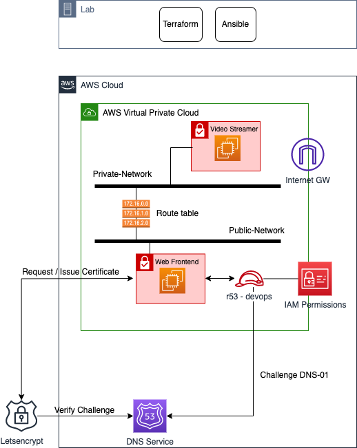

# AWS Video Streaming App Automation project

- [AWS Video Streaming App Automation project](#aws-video-streaming-app-automation-project)
  - [Objectives](#objectives)
  - [Application architecture](#application-architecture)
  - [Automation steps](#automation-steps)
  - [Project technical guidelines](#project-technical-guidelines)
    - [On video Streamer](#on-video-streamer)
    - [On the Web Frontend](#on-the-web-frontend)


---

## Objectives

The project aims to develop an automation environment to deploy a Video Streaming service deployed on AWS public cloud.

You will reuse the knowledge from the previous sessions to deploy the necessary network infrastructure (VPC, Internet Gateway, Subnets, Routing Table) and 2x VMs (EC2 instance) to run the video and web applications following a 2-tier design pattern.

One VM (Video Streamer) runs a Video Streamer application to stream video towards the other VM (Web Frontend). The Web Frontend VM ingests stream from the Video Streamer app and serves the video to the end users via HTTPS.

End users can only access the Web Frontend using HTTPS on port 443, and have no access to the Video Streamer. Web Frontend has a valid SSL certificated. Communication between Video Streamer and Web Frontend is restricted to the only necessary ports required for stream ingestion.

---

## Application architecture

The diagram below highlights the target architecture which needs to be deployed and configured (through an automated process):



---

## Automation steps

The different steps we foresse for the automation process are highlighted below:

1. TF AWS: the procedure includes the deployment of 2xEC2 instances (Video Streamer, Web Frontend) as well as VPC, Internet Gateway, Subnets, Routing Table or Routes. *It has been already done in a previous session during the Terraform lab.*
2. Ansible: the procedure includes the installation/configuration of the NGINX application on the Web Frontend EC2 instance and FFmpeg on the Video Streamer instance. *It has been almost done in a previous session during the Ansible lab.*

---

## Project technical guidelines

### On video Streamer

Linux Package dependencies
* ffmpeg

Creative Commons Attribution 3.0 sample videos : [https://download.blender.org/demo/movies/BBB/](https://download.blender.org/demo/movies/BBB/)

This command is used to stream a video file (BigBuckBunny_320x180.mp4) in a loop to an RTMP server
```
ffmpeg \
-stream_loop -1 \                      # Loops the input video infinitely
-re \                                   # Read input at native frame rate (for real-time streaming)
-i /videos/BigBuckBunny_320x180.mp4 \   # Input video file (Big Buck Bunny in this case)
-c:v libx264 \                          # Video codec: encode the video using the H.264 codec
-c:a aac \                              # Audio codec: encode the audio using the AAC codec
-f flv \                                # Output format: FLV (Flash Video), common for RTMP streaming
rtmp://<rtmp-server-ip>:1935/live/stream      # RTMP server URL: destination for the stream, targeting a live RTMP stream on the nginx-rtmp server
```

### On the Web Frontend

Linux Package dependencies
* nginx
* libnginx-mod-rtmp
* ffmpeg

Create Root folder `stream`, for DASH and HLS chunks.  
```
mkdir /var/www/html/stream
```

Content of `/etc/nginx/nginx.conf` provided as reference :

```
worker_processes  1;
load_module "modules/ngx_rtmp_module.so";

events {
    worker_connections  1024;
}

http {
    sendfile        on;
    tcp_nopush      on;
    tcp_nodelay     on;
    keepalive_timeout  65;
    types_hash_max_size 2048;

    include         /etc/nginx/mime.types;
    include         /etc/nginx/sites-enabled/*;

    default_type    application/octet-stream;
    
    server {
        listen 8080;

        # rtmp control
        location /control {
            rtmp_control all;
        }
    }
}

rtmp {
    server {
        listen 1935;
        chunk_size 4096;

        application live {
            live on;
            record off;

            allow publish 127.0.0.0/16;
            allow publish 192.168.0.0/16;
            deny publish all;
        

            hls on;
            hls_path /var/www/html/stream/hls;
            hls_fragment 3;
            hls_playlist_length 60;

            dash on;
            dash_path /var/www/html/stream/dash;
            dash_fragment 15s;

        }
    }
}
```

Content of `/etc/nginx/sites-enabled/streamer` provided as reference :

```
server {
    listen 80;

    location /hls {
        add_header Access-Control-Allow-Origin *;
        root /var/www/html/stream;
    }
    
    autoindex_localtime on;

    location /dash {
        # Disable cache
        add_header 'Cache-Control' 'no-cache';

        # CORS setup
        add_header 'Access-Control-Allow-Origin' '*' always;
        add_header 'Access-Control-Expose-Headers' 'Content-Length';

        # Allow CORS preflight requests
        if ($request_method = 'OPTIONS') {
            add_header 'Access-Control-Allow-Origin' '*';
            add_header 'Access-Control-Max-Age' 1728000;
            add_header 'Content-Type' 'text/plain charset=UTF-8';
            add_header 'Content-Length' 0;
            return 204;
        }

        types {
            application/dash+xml mpd;
            video/mp4 mp4;
        }

        root /var/www/html/stream;
    }

    
}
```

---
